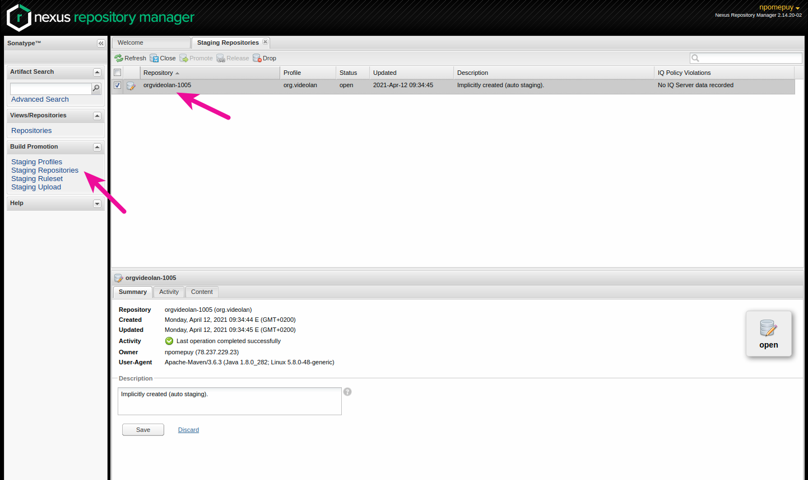

# Deploy artifacts

## Prerequisites

### Signing

Use [this guide](https://github.com/drduh/YubiKey-Guide#configure-smartcard) to setup a yubikey with the VideoLAN maven signing key. The key id is `49A7E6FE58DCF183F0B349DFB83763AD62ED0721` 

### Utilities

Apache Maven is needed.

`sudo apt install maven`

### Sonatype

You have to get Sonatype credentials. To ask for it, you will have to create a JIRA account and ask to be added [here](https://issues.sonatype.org/browse/OSSRH-65611)

## Generate the artifacts

Create a git tag named `libvlc-[libvlc-version]`. The CI will generate the libvlc and medialibrary artifacts and the debug symbols. All of these files will be available to download in a zip file named `dbg.zip` attached to the pipeline.

Copy the file to this directory (`buildsystem/maven`)

## Usage

You just have to plug your yubikey and run the script

`./deploy-to-mavencentral.sh [FILE_PATH]`

The script will do the following actions:

- check if the zip exists
- unzip it
- look for the artifact versions
- let you confirm if it's all good
- let you enter your Sonatype credentials
- create a new `settings.xml` file in the current directory. /!\ If the script fails after this point, make sure you delete this file to avoid having your credentials exposed /!\
- sign and deploy the artifacts with Apache Maven
- delete the `settings.xml` file

### Release artifacts

Once the artifacts have been deployed, you still need to release the repository.

- Go to the [Nexus Repository Manager](https://s01.oss.sonatype.org/)
- Login with your credentials
- Navigate to `Build Promotion` / `Staging Repositories`
- Select the `org.videolan` repository

- Close it
- Wait for it to be closed
- Release it

When it's done, the artifacts should be available in Maven Central within a few minutes. To verify, you can navigate to:
- [libvlc](https://repo1.maven.org/maven2/org/videolan/android/libvlc-all/)
- [medialibrary](https://repo1.maven.org/maven2/org/videolan/android/medialibrary-all/)

After a few hours, they should also be available in the [Maven Search Engine](https://search.maven.org/search?q=g:org.videolan.android)